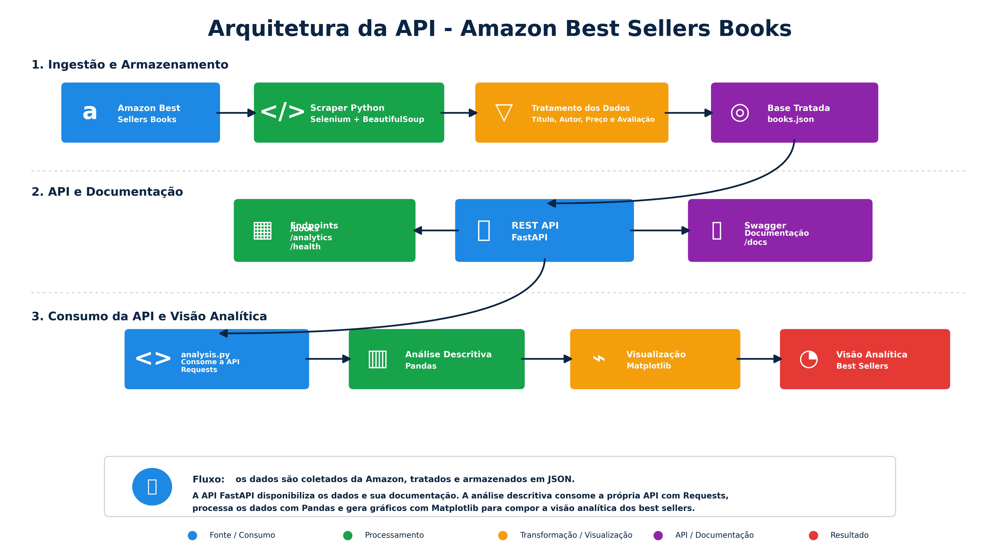

# Amazon Best Sellers Books API

## Sobre o Projeto

Este projeto foi desenvolvido como parte da **Prova Substitutiva – Fase 1** da disciplina **Machine Learning Engineering** da Pós-Graduação ON.

O objetivo da solução consiste em construir uma **REST API em Python** capaz de consultar livros **Best Sellers da Amazon**, além de realizar uma **análise descritiva** sobre os dados coletados.

A solução contempla:

- Coleta automatizada dos livros best sellers;
- Tratamento e estruturação dos dados;
- Disponibilização das informações por meio de uma REST API;
- Documentação automática da API;
- Consumo da própria API para geração de análises;
- Visão analítica dos livros best sellers.

---

# Objetivo da Solução

O projeto realiza a coleta dos livros disponíveis no ranking **Amazon Best Sellers – Books**, extraindo informações sobre:

- Nome do livro;
- Autor(a);
- Avaliação;
- Preço.

Os dados são tratados e armazenados em formato JSON, disponibilizados por uma API desenvolvida com FastAPI e posteriormente consumidos para geração de análises e gráficos descritivos.

---

# Arquitetura da Solução

A arquitetura contempla todo o fluxo da solução, desde a ingestão dos dados até a visão analítica.



---

# Fluxo da Arquitetura

1. Coleta dos livros na Amazon Best Sellers;
2. Scraper Python utilizando Selenium e BeautifulSoup;
3. Scroll automático para carregamento dinâmico das páginas;
4. Tratamento e limpeza dos dados;
5. Armazenamento estruturado em JSON (`books.json`);
6. Disponibilização via REST API com FastAPI;
7. Documentação automática via Swagger;
8. Consumo da própria API pelo `analysis.py`;
9. Processamento analítico com Pandas;
10. Geração de gráficos com Matplotlib;
11. Construção da visão analítica dos best sellers.

---

# Estrutura do Projeto

```text
PROVA-SUB-FASE1-RM360673
│
├── assets/
│   ├── arquitetura_api_final.png
│   ├── analise_descritiva.txt
│   ├── distribuicao_avaliacoes.png
│   ├── distribuicao_precos.png
│   ├── top_autores.png
│   └── top_10_best_sellers_precos.png
│
├── data/
│   ├── raw/
│   └── processed/
│       └── books.json
│
├── docs/
│
├── src/
│   ├── scraper.py
│   ├── main.py
│   ├── analysis.py
│   ├── schemas.py
│   └── architecture.py
│
├── tests/
│   └── test_api.py
│
├── README.md
├── requirements.txt
├── render.yaml
├── entrega.txt
└── .gitignore
```

---

# Tecnologias Utilizadas

O projeto foi desenvolvido utilizando:

- Python
- FastAPI
- Uvicorn
- Selenium
- BeautifulSoup
- Requests
- Pandas
- Matplotlib
- JSON

---

# Coleta e Tratamento dos Dados

A coleta foi realizada diretamente na página Amazon Best Sellers – Books.

O scraper utiliza:

- Selenium em modo headless;
- Scroll automático para carregamento dinâmico;
- BeautifulSoup para parsing do HTML;
- Navegação pelas duas páginas do ranking;
- Coleta total de 100 livros best sellers.

Durante o processamento são realizados:

- Limpeza dos textos;
- Tratamento de encoding;
- Conversão de preços;
- Conversão de avaliações;
- Padronização dos campos;
- Estruturação da base final `books.json`.

---

# REST API

A API foi desenvolvida utilizando FastAPI.

## Inicialização da API

```bash
uvicorn src.main:app --reload
```

A aplicação será disponibilizada em:

```text
http://127.0.0.1:8000
```

---

# Endpoints Disponíveis

## Health Check

```text
GET /health
```

Retorna o status da API.

---

## Página Inicial

```text
GET /
```

Retorna informações gerais da API.

---

## Listar Livros

```text
GET /books
```

Parâmetros opcionais:

- limit
- skip

---

## Buscar Livro por ID

```text
GET /books/{id}
```

---

## Buscar Livro por Autor

```text
GET /books/search?author=nome
```

---

# Endpoints Analíticos

## Resumo Geral

```text
GET /analytics/summary
```

---

## Livros Mais Bem Avaliados

```text
GET /analytics/top-rated
```

---

## Estatísticas de Preço

```text
GET /analytics/price-stats
```

---

## Autores Mais Frequentes

```text
GET /analytics/authors
```

---

# Documentação Swagger

A documentação automática da API pode ser acessada em:

```text
http://127.0.0.1:8000/docs
```

A interface Swagger permite:

- Visualizar endpoints;
- Testar requisições;
- Validar parâmetros;
- Explorar os retornos da API.

---

# Análise Descritiva

A análise descritiva foi implementada no arquivo:

```text
src/analysis.py
```

Importante:

O processo analítico **não consome diretamente o arquivo JSON**.

A análise consome a própria API utilizando Requests, fortalecendo a arquitetura da solução e demonstrando integração entre os componentes da aplicação.

Fluxo da análise:

```text
FastAPI → Requests → Pandas → Matplotlib
```

---

# Execução da Análise

Com a API em execução:

```bash
uvicorn src.main:app --reload
```

Execute:

```bash
python src/analysis.py
```

O script irá:

- Consumir os dados da API;
- Gerar análises estatísticas;
- Criar gráficos;
- Salvar os resultados na pasta `assets/`.

---

# Gráficos Gerados

## Top 10 livros por preço

```text
assets/top_10_best_sellers_precos.png
```

## Distribuição das avaliações

```text
assets/distribuicao_avaliacoes.png
```

## Distribuição de preços

```text
assets/distribuicao_precos.png
```

## Autores mais frequentes

```text
assets/top_autores.png
```

---

# Como Executar o Projeto

## 1. Criar ambiente virtual

```bash
python -m venv .venv
```

## 2. Ativar ambiente virtual

### Windows

```bash
.venv\Scripts\activate
```

## 3. Instalar dependências

```bash
pip install -r requirements.txt
```

## 4. Executar o scraper

```bash
python src/scraper.py
```

## 5. Executar a API

```bash
uvicorn src.main:app --reload
```

## 6. Executar análise descritiva

```bash
python src/analysis.py
```

---

# Deploy da Aplicação

O projeto está preparado para deploy utilizando Render.

Arquivo utilizado:

```text
render.yaml
```

---

# Testes

Os testes automatizados estão disponíveis em:

```text
tests/test_api.py
```

---

# Autor

Projeto desenvolvido para a disciplina:

**Machine Learning Engineering – Pós-Graduação ON**

Aluno: **Paulo Sérgio Martins Junior**

---

# Entrega Acadêmica

A entrega final contempla:

- Código-fonte no GitHub;
- REST API funcional;
- Documentação Swagger;
- Arquitetura da solução;
- Visão analítica;
- Deploy da aplicação;
- Vídeo demonstrativo.